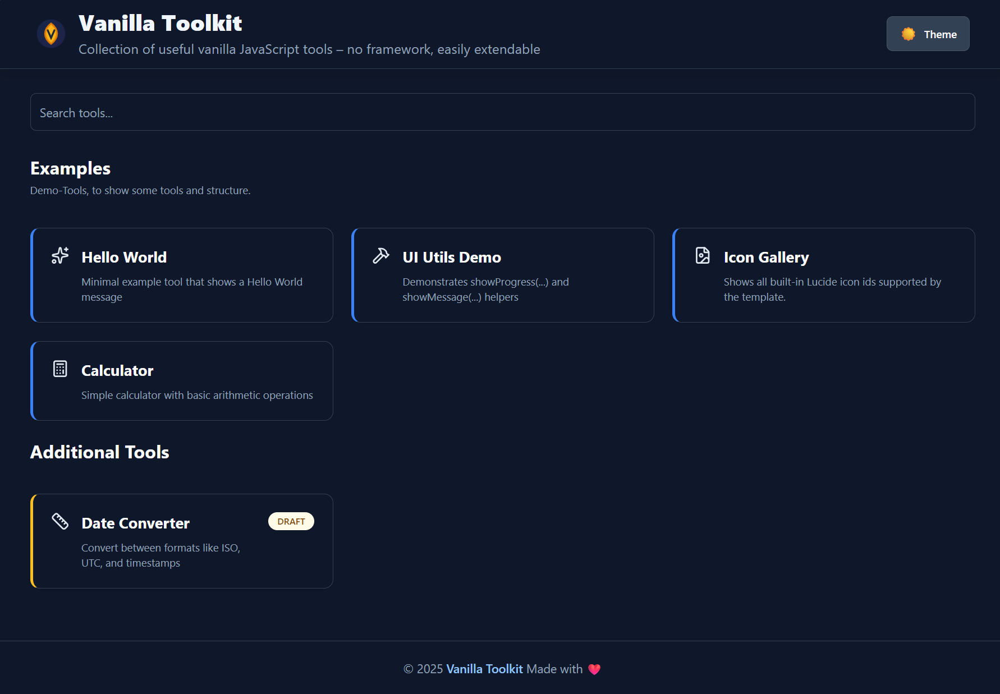

# Vanilla Toolkit



Minimalistic, lightning-fast tool collection  
Vite + TypeScript + Tailwind – **no React, no framework**

## Features

- Add new tools via folder → appear automatically
- Search function with live filter
- Unified design with header & footer
- 100% offline-capable

## Create a new tool (30 seconds)

Create a folder inside `src/tools/`. 
The folder name becomes the tool’s **path/URL slug**.

```bash
src/tools/my-tool/
├── config.json     # Name + description + configuration
├── template.html   # Your layout
└── index.ts        # Your logic (optional)
```

### 1) Add `config.json`

Minimal example:

```json
{
  "name": "My Tool",
  "description": "Does something useful",
  "draft": false,
  "example": false
}
```

Notes:
- `name` and `description` are shown on the overview page and used for search.
- `draft: true` hides the tool from the normal overview (useful while you’re still building it).
- `example: true` is intended for template/demo tools (you can ignore it in real projects).

Optional fields you can add later:
- `icon`: an icon id (see **Tool Icons (Lucide)** below)
- `order` / `sectionId`: for sorting & grouping (see next section)

### 2) Add `template.html`

This is the tool’s UI. Keep it small and composable (cards, inputs, buttons).
- Prefer semantic HTML (`label`, `input`, `button`)—it improves accessibility quickly.
- Prefer using daisyUI component classes together with Tailwind utility classes for consistent UI patterns.
- Avoid heavy use of Tailwind's `dark:` prefix — prefer daisyUI themes or CSS variables for theme-aware styling (examples below).

Practical tips:
- Give your tool a single root container so it’s easy to render/replace.
- Prefer semantic HTML (`label`, `input`, `button`)—it improves accessibility quickly.

### 3) Add behavior in `index.ts` (optional)

If your tool is interactive, put the logic in `index.ts`.
Typical responsibilities:
- Wire up event listeners (click, input, submit)
- Read/write values from the DOM
- Implement the actual tool logic (formatting, conversions, generators, etc.)

Keep it defensive:
- Validate user input before processing
- Handle empty states (e.g. “nothing entered yet”)
- Avoid throwing on malformed input—show a message instead

**Export style**

Your tool entry can be exported either as a default export **or** as a named `init` export:

```ts
// Default export
export default function init() {
  // ...
}

// Named export
export function init() {
  // ...
}
```

**Important: cleanup when navigating between tools**

Tools can be opened/closed via routing, so your `index.ts` may run multiple times.
If you attach any **global** listeners (e.g. `document.addEventListener`, `window.addEventListener`), timers (`setInterval`), observers, etc.,    
make sure you return a **cleanup function** that removes them.

```ts
export default function init() { 
    const onKeyDown = (e: KeyboardEvent) => { 
        // ... 
    };
    document.addEventListener('keydown', onKeyDown);
    
    // Return cleanup to prevent duplicate listeners when navigating away/back 
    return () => { 
        document.removeEventListener('keydown', onKeyDown); 
    }; 
}
```

Rule of thumb:
- Listeners on elements that get replaced with the tool DOM are usually fine.
- Anything attached to `document` / `window` should be cleaned up.

### 4) Run it

Start the dev server and open the app:

```bash
pnpm run dev
```

Your tool should appear automatically on the overview page.
If it doesn’t:
- Check that the folder is directly under `src/tools/<tool-name>/`
- Ensure `config.json` is valid JSON (no trailing commas)
- Restart the dev server after renaming folders/files

### Common patterns (quick checklist)

- **Hide until ready:** set `"draft": true`
- **Make it discoverable:** write a clear `description` (it powers search)
- **Keep it stable:** don’t rename the folder unless you’re okay with the URL changing

## Tool-specific dependencies (`pnpm-workspace.yaml`)

Each tool can declare its own dependencies by adding a `package.json` inside its folder.   
This is supported by the project’s `pnpm-workspace.yaml` setup.

**Example:**  
The tool `example-package` in this project add its own dependencies:    
_(demo purpose only with a lightweight dependency)_

`// src/tools/example-package/package.json`
```json
{
  "name": "example-package",
  "version": "1.0.0",
  "dependencies": {
    "is-odd": "3.0.1"
  }
}
```

- Run pnpm install at the project root to install all tool dependencies.
- Each tool’s dependencies are isolated and won’t affect others.

> Note:
> This allows tools to use different libraries or versions as needed, 
> without polluting the main project dependencies.


## Optional: `src/main.ts` (custom startup invocation)

In addition to per-tool scripts, you can add an optional **project-level entry hook**: `src/main.ts`.

If the file exists, it will be auto-imported and executed **once on startup** — **before** the initial route (overview/tool) is rendered.  
This is useful for global, one-time setup such as:

- registering additional / overriding icons
- adding global event listeners
- initializing app-wide utilities
- debugging/logging (e.g. number of loaded tools)

### Export shape

You can provide either a default export **or** a named `init` export. Both may be `async`:

```ts
// src/main.ts 
import type { CustomMainContext } from './js/types';

export default function main(ctx: CustomMainContext) { 
    console.log('Loaded tools:', ctx.tools.length); 
    // global setup... 
}

// alternatively: 
export function init(ctx: CustomMainContext) { 
    // ... 
}
```

### Context (`ctx`)

Currently, the context contains the already-discovered tool list:

- `ctx.tools`: all tools (including metadata), as used later for overview + routing.

### Important note about side effects

This `main.ts` invocation is a **one-time hook** (not a routing lifecycle).  
If you register global side effects here
(e.g. `window.addEventListener`, timers, observers),
you are responsible for managing cleanup yourself — unlike tool `index.ts`,
which can return a cleanup function.


## Ordering & Section grouping (Overview page)

Tools can be **sorted** and **grouped into sections** on the overview page by adding two optional fields to a tool’s `config.json`:

- `order` *(number)*: controls the position within a section (ascending)
- `sectionId` *(string)*: groups tools into a named section

### Example `config.json`

```json
{ 
  "name": "My Tool", 
  "description": "Does something useful", 
  "draft": false, 
  "example": false, 
  "sectionId": "examples", 
  "order": 1
}
```

### How sorting works

- Tools are sorted by:
    1. `order` (ascending)
    2. `name` (A → Z) as a tie-breaker

This means you can keep the list stable and intentional, even when multiple tools share the same `order`.

### How sections work

- Tools with the same `sectionId` are rendered under the same section header.
- Section header text (title + optional description) is configured in the site config (see below).
- If a tool has a `sectionId` that is **not configured**, the UI falls back to showing the raw `sectionId` as the section title.
- If a tool has **no** `sectionId`, it is grouped into a default “other” section.

### Configure section titles via `SiteConfig`

Section titles and descriptions live in the site configuration.

1. Copy the template config:
    - `src/config/site.config.template.ts` → `src/config/site.config.ts`
2. Define your sections (keys are the `sectionId`s):

```ts
export const siteConfig = { 
  // ... 
  toolSections: { 
      examples: { title: 'Examples', description: 'Demo tools that show how the template works.', }, 
      general: { title: 'General', description: 'Everyday helpers and utilities.', }, 
  }, 
};
```
**Section order:**  
Sections are rendered in the insertion order of `toolSections` first, followed by any additional sections discovered at runtime.


### Site configuration override

The default configuration lives in `src/config/site.config.template.ts`.     
To customize the configuration for your project, copy the file to the Name `site.config.ts` and change any configuration values.
See types in `src/config/site.config.ts` for possible values.


## Tool Icons (Lucide)

Each tool can optionally define an icon in its `config.json`.

Use the icon id syntax from lucide (lower case with dashes)

If `icon` is missing or unknown, a default icon is used.

### Available icon ids

per default all lucide icons are included.
You can add additional icons registering them at startup (see `src/main.ts`).

### Register custom icons (derived projects)

This template exposes an icon registry so derived projects can add (or override) icon IDs without editing `src/js/tool-icons.ts`.

1) Import `registerToolIcons` in your entry file (e.g. `src/script.ts`).

2) Import any additional icons you want from `lucide` or any other source follwing the syntax.

3) Register them at once during startup (see `main.ts` hook above).

```ts
import { registerToolIcons } from 
        './src/js/tool-icons';
import { ArrowLeft } from '@lucide/icons';
    
registerToolIcons({
    ArrowLeft: ArrowLeft,
    // add more icons here
});
```

Now you can reference your new icon IDs from any tool `config.json`:

```json
{ 
  "name": "My Tool", 
  "description": "Does something useful", 
  "icon": "arrow-left"
}
```

Notes:
- If an ID is unknown, the renderer falls back to a default icon.
- If you register an existing ID, it will override the built-in icon for that ID.

---

## Template Placeholders

Brief and practical:

- Syntax: Use `{{ key.path }}` inside your HTML templates, e.g. `{{ config.title }}`.
- When they are replaced: Placeholders are replaced by the central function `replacePlaceholders()` (see `src/js/utils.ts`). In this codebase the header and footer templates are processed before being inserted into the DOM (`src/js/render.ts`).
- Where the values come from: Values are read from the exported `siteContext` in `src/config/index.ts`. `siteContext` merges the defaults from `site.config.template.ts` with an optional `src/config/site.config.ts` file.
- How it works: `replacePlaceholders()` uses the regex `/\{\{(.+?)\}\}/g`, trims the path and resolves the value using dot-notation with `getValueByDotNotation()`.
- Missing values: If a placeholder cannot be resolved, a console warning is emitted and the placeholder is replaced with a visible marker such as `[{{...} NOT FOUND]` to make the issue obvious.

 
Example (Template → Result):


```html
<!-- Template -->
<h1>{{ config.title }}</h1>

<!-- After replacement -->
<h1>Vanilla Toolkit</h1>
```


---

## Dark/Light Mode

This project works with Tailwind's class strategy but also supports daisyUI's theme system. In practice prefer daisyUI theme tokens and components instead of sprinkling many `dark:` utilities across your templates.

Why prefer daisyUI tokens?
- daisyUI exposes semantic tokens (e.g. `bg-base-100`, `text-base-content`, `border-base-300`) that automatically adapt to the active theme.
- You get ready-made components (`btn`, `card`, `input`, `form-control`, etc.) and consistent spacing/colors with minimal classes.
- Theme switching is handled via the `data-theme` attribute on `<html>` (or `document.documentElement`), which is simpler than toggling many `dark:` variants.

Quick daisyUI examples (concise):

```html
<!-- Card -->
<div class="card bg-base-100 shadow-md p-4">
  <h3 class="text-lg font-semibold">Card title</h3>
  <p class="text-sm text-base-content/70">Card content</p>
</div>

<!-- Button -->
<button class="btn btn-primary">Save</button>

<!-- Input -->
<div class="form-control">
  <label class="label"><span class="label-text">Name</span></label>
  <input class="input input-bordered" type="text" />
</div>
```

Theme-aware tokens (preferred replacements for common pairs):
- Use `bg-base-100` instead of `bg-white` / `dark:bg-slate-800`.
- Use `text-base-content` instead of `text-gray-900` / `dark:text-white`.
- Use `border-base-300` instead of `border-gray-200` / `dark:border-slate-700`.
- Use `btn`, `btn-primary`, `btn-outline` for buttons instead of crafting many color utilities.

Toggling theme (simple script):

```js
// set theme to 'dark' or 'light' (or any daisyUI theme name)
document.documentElement.setAttribute('data-theme', 'dark');
// read current theme
const theme = document.documentElement.getAttribute('data-theme');
```

When to still use `dark:`
- For very small, local overrides where a single property needs a different value in dark mode.
- For legacy templates that already rely on `dark:` variants and where migration isn't worth the effort.

Rule of thumb:
- Prefer daisyUI tokens and components for most UI work.
- Use `dark:` sparingly for edge-case, one-off style changes.

### Focus & Hover States with daisyUI
Most components include sensible focus/hover styles. If you need custom behavior, combine tokens with Tailwind utilities:

```html
<input class="input input-bordered focus:ring-2 focus:ring-primary/60" aria-label="Example input" />
<button class="btn btn-primary hover:brightness-90">Action</button>
```

### Custom styles
Add your own custom styles to `src/css/styles.css` below the marker comment to avoid conflicts with the template styles on merge. 


---

## Extending `SiteContext` (derived projects)

This template is meant to be cloned (GitHub template). To allow project-specific context fields without modifying the core template types, `SiteContext` exposes a TypeScript **declaration merging** extension point.

### What you can extend

`SiteContext` automatically includes everything you add to the global interface `SiteContextCustom`.

### How to use it in your cloned project

1) Create a declaration file (any name is fine), for example:

- `src/site-context.custom.d.ts`

2) Add your custom fields by extending `SiteContextCustom`:

```ts
declare global {
    interface SiteContextCustom {
        custom?: { foo: string; bar?: number; };
    }
}
export {};
```

After this, your `SiteContext` type will include `custom`, `features`, etc. everywhere it’s used.    
You can now use it in your tool configs and templates.

### Notes / troubleshooting

- Make sure TypeScript includes the file. Your `tsconfig.json` should include something like `src/**/*.d.ts` (or `src/**`).
- To avoid naming collisions, consider grouping your additions under a single top-level key (e.g. `custom`).


---

## Keeping Derived Projects Up-to-Date (Template Sync Workflow)

This template supports automatic updates for derived repositories using a GitHub Actions workflow. 
The workflow uses [`AndreasAugustin/actions-template-sync`](https://github.com/AndreasAugustin/actions-template-sync) 
to regularly or manually sync changes from the template repository into your project.

### Workflow Setup

The synchronization uses the existing workflow file `.github/workflows/template-sync.yml`.  
This workflow is configured to run **automatically at 00:00 UTC on the first day of every month** (`cron: '0 0 1 * *'`).  
You can also trigger it manually at any time via the GitHub Actions UI.

### How it works

- The workflow checks for updates in the template repository.
- If changes are found, it creates a pull request in your derived repository with the updates.
- You can review and merge the pull request to apply the changes.

### Ignoring files during sync

To prevent certain files or folders from being overwritten, a `.templatesyncignore` exist in the `.github` directory.    
Use glob patterns to specify files to ignore.

---

And above all, have fun with this template! 😊
